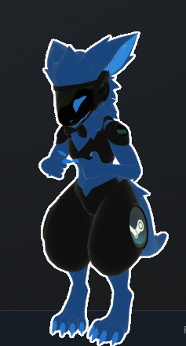

# VRChat ToolBox
Hello people i hope you like my toolbox, i spent quite a while making this but it is only made my me,
so bugs are expected but if you find any please report them in the discord server.

The discord server: https://discord.gg/YDXpQPF6g9

## Windows
Download `VRChat-ToolBox.exe` from **Releases** tab and run it.

(i have made this unbelievably simple i believe in you all you can do it :3)

## Linux
Run `VRChat-ToolBox.py` with Python 

(This is currently untested i haven't got round to testing it on my ubuntu install,
but if it works on your machine please tell me in the discord server)

```bash
python3 VRChat-ToolBox.py
```

i  tired so this will occasionally get updates sorwy if it takes ages 3:

